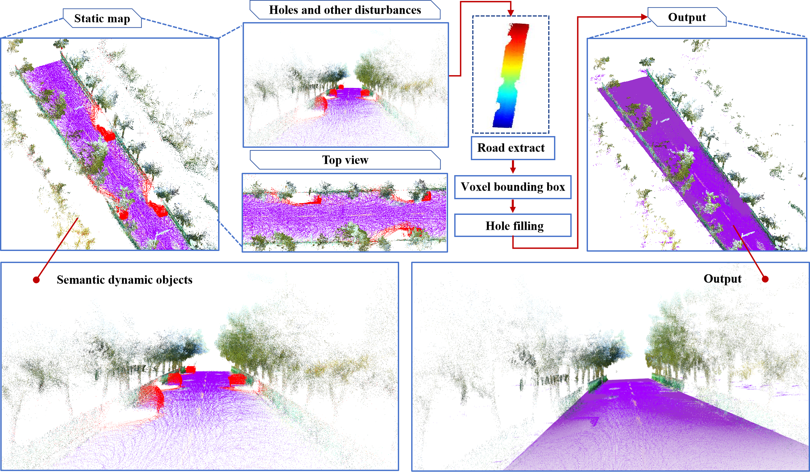
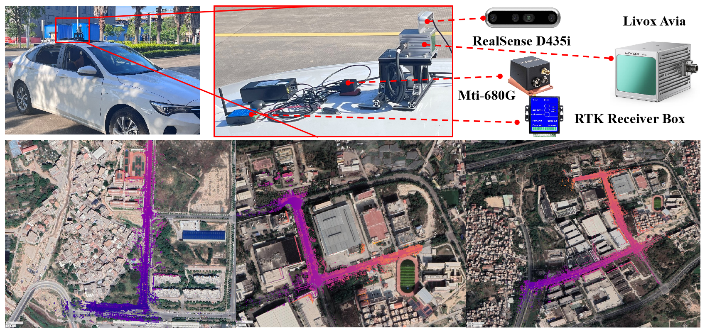

## RTS-SLAM
**RTS-SLAM：A Robust Real-Time Semantic SLAM for Dynamic Scenes**

<p align="center">
  
  <br>
  <em>Fig 1 :resultt</em>
</p>

## 1. Prerequisites
### 1.1 **Ubuntu** and **ROS**YOLOv8
**Ubuntu >= 18.04**
ROS    >= Melodic. [ROS Installation](http://wiki.ros.org/ROS/Installation)
### 1.2. **PCL && Eigen && OpenCV**
PCL    >= 1.8,   Follow [PCL Installation](http://www.pointclouds.org/downloads/linux.html).

Eigen  >= 3.3.4, Follow [Eigen Installation](http://eigen.tuxfamily.org/index.php?title=Main_Page).

Opencv >= 3.2.0, Follow[OpenCV_installation](https://github.com/opencv/opencv)
### 1.3. **livox_ros_driver**
Follow [livox_ros_driver Installation](https://github.com/Livox-SDK/livox_ros_driver).
### 1.4. **YOlOv8**
YOLOV8, Follow[ultralytics](https://github.com/ultralytics/ultralytics) 
## 2. Build
Clone the repository and catkin_make:

```
    cd ~/catkin_rts/src
    git clone https://github.com/Sam-songs/RTS-SLAM.git
    cd catkin_rts
    git submodule update --init
    cd ../..
    catkin_make
    source devel/setup.bash
```
- Remember to source the livox_ros_driver before build (follow 1.3 **livox_ros_driver**)
- If you want to use a custom build of PCL, add the following line to ~/.bashrc
```export PCL_ROOT={CUSTOM_PCL_PATH}```
## 3. Sensor Configuration
### 3.1 Extrinsic parameters
<p align="center">
  
  <br>
  <em>Fig 2 : Sensor Configuration</em>
</p>

We use the Livox avia for point cloud and IMU input, and the Intel RealSense d435i for RGB image input.

### 3.2 Time Synchronization
Used ROS：message_filters
## 4. Run
```
roslaunch mapping_avia.launch

conda activate your env

cv_bridge

python transtoipccicle.py

rosbag play example.bag
```

## 6.Acknowledgments

- Thanks for FAST-LIO2(Xu, Wei, et al. FAST-LIO2: Fast Direct LiDAR-inertial Odometry), [FAST-LIO2](https://github.com/hku-mars/FAST_LIO)
- Thanks for FAST-LIO-COLOR-MAPPING, [FAST_LIOMAPPING] (https://github.com/YWL0720/FAST-LIO-COLOR-MAPPING.git)
